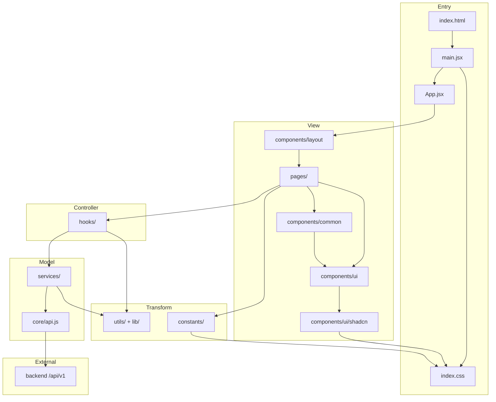

# Frontend Structure — ហៅប្រើ និងភ្ជាប់គ្នា

> ឯកសារនេះពន្យល់ **កន្លែងណាហៅអ្វី** និង **ភ្ជាប់ទៅកន្លែងណា** — សម្រាប់ review និង onboard developer ថ្មី។  
> សង្ខេប MVC: [MVC.md](./MVC.md) · ពេញលេញ: [FRONTEND_STRUCTURE.md](./FRONTEND_STRUCTURE.md)

---

## 1. ចាប់ផ្តើម app (Entry → Route)

```
index.html
    └── main.jsx          ← import index.css + mount <App />
            └── App.jsx     ← BrowserRouter, Providers, <Routes>
                    └── ProtectedRoute + Layout
                            └── pages/*.jsx   ← screen ដែល user ឃើញ
```

| ឯកសារ | តួនាទី | ហៅប្រើ |
|--------|--------|---------|
| `main.jsx` | Entry point | `index.css`, `App.jsx` |
| `App.jsx` | **Route layer** — map URL → page | `pages/`, `components/layout/`, `hooks/auth` |
| `index.css` | Global styles, shadcn `:root`, typography, glass | ប្រើដោយ Tailwind classes ទូទាំង app |

**Providers ក្នុង `App.jsx`:**

```
AuthProvider          ← hooks/auth/AuthContext.jsx
LanguageProvider      ← i18n/
MentorQuickViewProvider
PlatformContentProvider
```

---

## 2. MVC — លំហូទិន្នន័យ (Data flow)

គ្រប់ screen គួរតាម pattern នេះ:

```
URL (browser)
  ↓
App.jsx              Route      — ជ្រើស page + layout + guard
  ↓
pages/X.jsx          View       — JSX តែបង្ហាញ UI
  ↓
hooks/useX.js        Controller — state, useEffect, handlers
  ↓
services/xService.js Model      — fetch API
  ↓
services/core/api.js           — HTTP + cookies → backend /api/v1/…
  ↓
utils/xMapper.js     Transform  — raw JSON → shape សម្រាប់ UI
  ↓
hooks (setState) → pages re-render → components
```

### ឧទាហរណ៍ពិត: `Student Home`

```
/student/home
  → App.jsx                    <Route path="home" element={<Home />} />
  → pages/student/Home.jsx
       import { useMentors, useMentorFilters } from '@/hooks'
       import { PageSection, MentorList } from '@/components'
       import { TEXT } from '@/constants'
  → hooks/mentor/useMentors.js
       import { fetchMentors } from '@/services/mentors/mentorService'
  → services/mentors/mentorService.js
       import { apiRequest } from '@/services/core/api'
       import { ENDPOINTS } from '@/services/core/endpoints'
  → backend GET /api/v1/mentors
  → utils/mentorMapper.js      map response → MentorCard props
```

**Rule:** `pages/` **មិន** import `@/services/` ដោយផ្ទាល់ — ត្រូវឆ្លង `hooks/`។

---

## 3. UI layers — កន្លែងណាហៅ component

```
pages/student/Home.jsx
    │
    ├── @/components          ← common + layout (PageCard, MentorList, Navbar…)
    │       └── components/common/MentorList.jsx
    │               └── MentorCard.jsx
    │                       └── @/components/ui/Avatar
    │                       └── @/components/ui/Badge
    │
    ├── @/components/ui       ← primitives (app API)
    │       Button.jsx
    │       Input.jsx
    │       Modal.jsx
    │       └── wrap shadcn ↓
    │
    └── @/components/ui/shadcn ← foundation (Radix + cva)
            button.jsx
            input.jsx
            avatar.jsx
            dialog.jsx
            …
```

### តារាង UI — ហៅពីណា → ភ្ជាប់ទៅណា

| Layer | Folder | Import path | ភ្ជាប់ទៅ |
|-------|--------|-------------|----------|
| **Page** | `pages/` | — | `hooks`, `components`, `constants`, `i18n` |
| **Feature UI** | `components/common/` | `@/components` | `components/ui`, `constants` (TEXT) |
| **Layout** | `components/layout/` | direct or `@/components` | `pages` (children), `hooks/auth` |
| **App primitive** | `components/ui/*.jsx` | `@/components/ui/Button` | `components/ui/shadcn/*` |
| **Shadcn base** | `components/ui/shadcn/` | `@/components/ui/shadcn/button` | `@/lib/utils` (`cn`) |
| **Styles** | `index.css` | (global) | Tailwind `@apply`, `:root` vars |
| **Design tokens** | `constants/ui/` | `@/constants` | class names → `index.css` |

### Button — chain ពេញ

```
pages/.../BookSession.jsx
  className={...}
  <Button variant="primary" loading={...} />
      ↓
components/ui/Button.jsx          ← loading spinner, variant names (primary, danger…)
      ↓
components/ui/shadcn/button.jsx   ← cva variants, glass/rose styles
      ↓
@/lib/utils.js → cn()             ← merge Tailwind classes
      ↓
index.css + tailwind.config.js    ← --primary, primary-500, .glass-subtle
```

**Pages មិនដឹងពី shadcn** — import `@/components/ui/Button` តែប៉ុណ្ណោះ។

---

## 4. Styling — ភ្ជាប់ constants → CSS

```
constants/ui/typography.js     TEXT.pageTitle = 'text-page-title'
        ↓
index.css @layer components    .text-page-title { @apply text-xl … }
        ↓
components/common/PageHeader   className={TEXT.pageTitle}

constants/ui/tokens.js         brandColors, spacing helpers
        ↓
tailwind.config.js             primary-500, --primary HSL
        ↓
index.css :root                --background, --primary, --radius
        ↓
shadcn components              bg-primary, text-primary-foreground
```

| ឯកសារ config | តួនាទី |
|--------------|--------|
| `components.json` | shadcn CLI config (paths, cssVariables) |
| `tailwind.config.js` | Extend theme: colors, fonts, radius |
| `index.css` | shadcn `:root`, typography classes, glass system |

---

## 5. Folder map — អ្វីភ្ជាប់អ្វី

```
frontend/src/
│
├── main.jsx ──────────────────────────────┐
├── App.jsx ─── routes ────────────────────┤
│                                          │
├── pages/ ◄── View (screens)              │
│     │                                    │
│     ├── hooks/ ◄── Controller            │
│     │     │                              │
│     │     ├── services/ ◄── Model ───────┼──► backend /api/v1
│     │     │     └── core/api.js          │
│     │     │                              │
│     │     └── utils/ + lib/ ◄── Transform│
│     │                                    │
│     ├── components/ ◄── reusable View    │
│     │     ├── common/                    │
│     │     ├── layout/                    │
│     │     └── ui/ ──► shadcn/            │
│     │                                    │
│     ├── constants/ ◄── tokens, filters   │
│     ├── contexts/ ◄── global state       │
│     ├── i18n/ ◄── EN/KM strings          │
│     └── index.css ◄──────────────────────┘
```

---

## 6. Layout — URL ទៅ shell ណា

| Route group | Layout | Guard |
|-------------|--------|-------|
| `/`, `/login`, `/privacy` | `MainLayout` or none | public |
| `/student/*` | `MainLayout` + sidebar | `ProtectedRoute` role student |
| `/mentor/*` | `MainLayout` + sidebar | `ProtectedRoute` role mentor |
| `/admin/*` | `AdminLayout` | `ProtectedRoute` role admin |

```
App.jsx
  <Route element={<MainLayout />}>
    <Route path="student/home" element={<Home />} />
    <Route path="mentor/home" element={<MentorHome />} />
  </Route>
  <Route element={<AdminLayout />}>
    <Route path="admin/dashboard" element={<AdminDashboard />} />
  </Route>
```

Layout files: `components/layout/MainLayout.jsx`, `AdminLayout.jsx`, `ProtectedRoute.jsx`

---

## 7. Services — endpoint ទៅ backend

```
hooks/useMentorDashboard.js
  → mentorService.getDashboard()
  → apiRequest(ENDPOINTS.mentors.dashboard)
  → GET /api/v1/mentors/me/dashboard
```

| Service folder | Backend domain |
|----------------|----------------|
| `services/auth/` | `/api/v1/auth` |
| `services/mentors/` | `/api/v1/mentors` |
| `services/students/` | `/api/v1/students` |
| `services/admin/` | `/api/v1/admin` |
| `services/platform/` | subscriptions, notifications, content |
| `services/communities/` | communities |

គ្រប់ path សរសេរក្នុង `services/core/endpoints.js` តែមួយដង។

---

## 8. Import cheat sheet

| ត្រូវការ | Import |
|----------|--------|
| Screen logic | `import { useMentors } from '@/hooks'` |
| Shared UI block | `import { PageCard, MentorList } from '@/components'` |
| Button, Input | `import Button from '@/components/ui/Button'` |
| Typography class | `import { TEXT } from '@/constants'` |
| Translate | `import { useTranslation } from '@/i18n'` |
| API (ក្នុង hook តែប៉ុណ្ណោះ) | `import { mentorService } from '@/services'` |
| Pure mapper | `import { mapMentor } from '@/utils/mentorMapper'` |
| cn() helper | `import { cn } from '@/lib/utils'` |

**កុំ:** `pages/` → `@/services/`  
**កុំ:** `services/` → React hooks  
**កុំ:** `utils/` → fetch

---

## 9. Diagram សរុប



---

## 10. អ្វីដែល shadcn folder តិច

`components/ui/shadcn/` មាន **តែ components ដែល install** — មិនមែន library ពេញ។  
App ប្រើ **`components/ui/` wrappers** ជា public API; shadcn ជា **engine ក្រោម**។

ចង់បន្ថែម component:

```bash
cd frontend
npx shadcn@latest add table
```

រួច wrap ក្នុង `components/ui/` បើត្រូវការ app-specific API (ដូច `Button.jsx`)។
